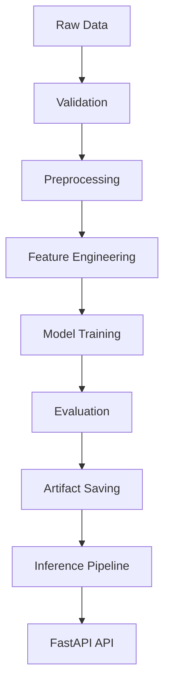
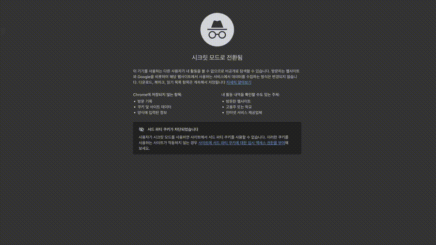
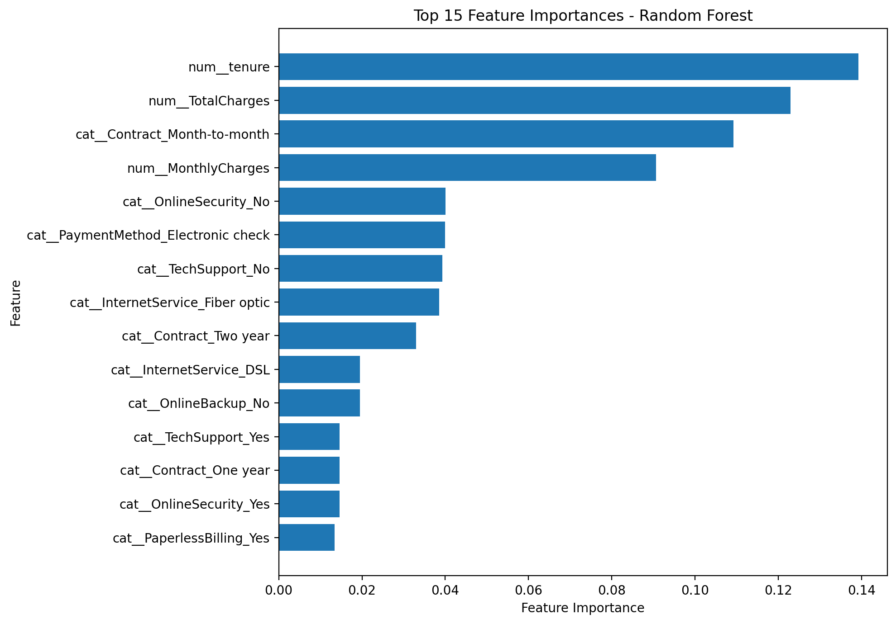

# 🚀 End-to-End ML Analytics System

<p align="center">
  <a href="https://ml-churn-api-2z9m.onrender.com/docs">
    
  </a>
  <a href="https://ml-churn-api-2z9m.onrender.com/docs">
    
  </a>
</p>

<p align="center">
  
  
  
  
  
</p>

---

## 📌 Overview
This project is a **production-grade machine learning system** for customer churn prediction, fully deployed as a live API service.

It demonstrates a full ML lifecycle:

```text
Data → Preprocessing → Feature Engineering → Model → Evaluation → API → Testing
```

Unlike typical notebooks, this project is structured as a **deployable ML system with API and automated tests**.

---

## 🎯 Key Features

- ✅ End-to-end ML pipeline (EDA → inference)
- ✅ Artifact-based inference (model & preprocessor separation)
- ✅ FastAPI-based prediction service
- ✅ Full test coverage (API / preprocess / features / training)
- ✅ Production-style modular architecture

---

## 🧠 Problem Statement
Customer churn directly impacts:

- Revenue stability
- Customer lifetime value (CLV)
- Retention cost

This system predicts **churn probability** using structured customer data.

---

## 🏗️ System Architecture



---

## 📁 Project Structure

```bash
end-to-end-ml-analytics-system/
│
├── src/
│   ├── api/            # FastAPI app
│   ├── data/           # load / validate / preprocess
│   ├── features/       # feature engineering
│   ├── models/         # train / evaluate / predict
│   ├── pipelines/      # training & inference pipelines
│   └── utils/          # config, logging
│
├── notebooks/          # EDA & experiments
├── artifacts/          # saved models & metrics
├── tests/              # pytest-based test suite
├── Dockerfile
└── README.md
```

---

## ⚙️ Tech Stack

| Category | Stack |
|--------|------|
| Language | Python |
| Data | pandas |
| ML | scikit-learn |
| API | FastAPI |
| Testing | pytest |
| Deployment | Docker |

---

## 🔬 ML Pipeline Details

### 1. Data Processing
- Load dataset
- Validate schema
- Target transformation (`Churn → Churn_binary`)

### 2. Preprocessing
- Feature / target split
- Stratified train/valid split

### 3. Feature Engineering
- Numeric → imputation + scaling
- Categorical → imputation + one-hot encoding

### 4. Model
- Logistic Regression
- Random Forest (default)

### 5. Evaluation Metrics
- Accuracy
- Precision / Recall / F1
- ROC-AUC
- Threshold-based evaluation

### 6. Inference
- Load artifacts (model + preprocessor)
- Transform input
- Predict probability & label

---

## 🌐 API Usage

### 🔗 Live API (Deployed)
👉 https://ml-churn-api-2z9m.onrender.com/docs

You can directly test the model via Swagger UI without local setup.

### Run server
```bash
uvicorn src.api.main:app --reload
```

### Swagger
👉 http://127.0.0.1:8000/docs

### Example Request
```json
{
  "gender": "Female",
  "SeniorCitizen": 0,
  "Partner": "Yes",
  "Dependents": "No",
  "tenure": 12,
  "PhoneService": "Yes",
  "MultipleLines": "No",
  "InternetService": "Fiber optic",
  "OnlineSecurity": "No",
  "OnlineBackup": "Yes",
  "DeviceProtection": "No",
  "TechSupport": "No",
  "StreamingTV": "Yes",
  "StreamingMovies": "Yes",
  "Contract": "Month-to-month",
  "PaperlessBilling": "Yes",
  "PaymentMethod": "Electronic check",
  "MonthlyCharges": 89.85,
  "TotalCharges": 1081.25
}
```

### Example Response
```json
{
  "predicted_label": 1,
  "churn_probability": 0.66
}
```

---

## 🎥 Live Demo

The following demo shows a real-time API interaction via Swagger UI:



Workflow demonstrated:
- Select prediction endpoint
- Input structured customer data
- Execute inference request
- Receive probability-based prediction

This highlights the system’s **end-to-end inference capability in a production environment**.

---

## 🧪 Testing

Run all tests:
```bash
pytest -v
```

### Coverage
- API (`test_api.py`)
- Preprocessing (`test_preprocess.py`)
- Feature Engineering (`test_features.py`)
- Training (`test_train.py`)

```text
✔ All tests passing
✔ Full ML pipeline validated
```

---

## 📊 Model Performance (Baseline)

| Metric | Score |
|------|------|
| Accuracy | ~0.79 |
| ROC-AUC | ~0.83 |
| F1 Score | ~0.57 |

---

## 📊 Feature Importance (Model Interpretability)

Understanding which features drive predictions is critical in production ML systems.



Top contributing features include:
- Contract type
- Customer tenure
- Monthly charges

This provides insight into model decision-making and ensures the system remains **interpretable, transparent, and production-ready**.

---

## 📌 Current Status

- [x] EDA
- [x] Feature engineering
- [x] Model training
- [x] Evaluation
- [x] Inference pipeline (artifact-based)
- [x] FastAPI deployment
- [x] Test suite
- [x] Docker deployment
- [x] Cloud deployment (Render)

---

## 🚀 Future Improvements

- Advanced model optimization (XGBoost / LightGBM)
- Real-time inference pipeline (streaming data)
- User authentication & request logging
- Model monitoring (drift detection)
- CI/CD pipeline (GitHub Actions)
- Multi-model A/B testing framework

---

## 💡 Summary

This project demonstrates:

✔ Transition from notebook → production system  
✔ Clean ML architecture  
✔ API integration  
✔ Automated validation via testing  

👉 Designed for **ML Engineer / AI Engineer portfolio**

---

## 🔥 Production Highlights

- ✔ Live deployed ML API (Render)
- ✔ Dockerized service
- ✔ Artifact-based inference architecture
- ✔ Full unit test coverage
- ✔ Modular, scalable ML pipeline design

👉 This project reflects **real-world ML system design**, not just experimentation.