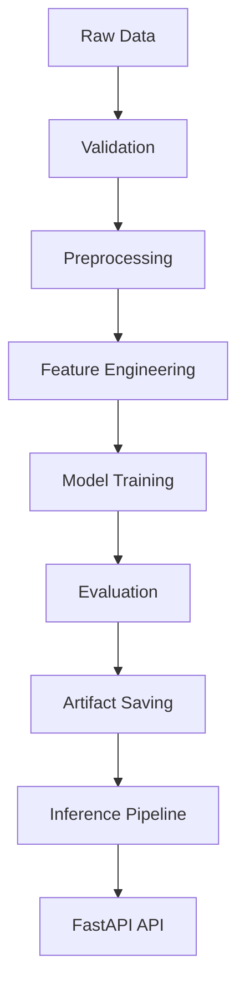

# End-to-End ML Analytics System

## Overview
This project is a production-oriented machine learning analytics system for customer churn prediction.
It covers the full ML workflow: data loading, preprocessing, feature engineering, model training, evaluation, and API-based inference.

## Project Goal
The goal is to demonstrate an end-to-end ML engineering workflow that is reproducible, modular, and deployable.

## Tech Stack
- Python
- pandas
- scikit-learn
- FastAPI
- Docker

## Problem Statement
Customer churn directly impacts retention cost and revenue stability.
This project predicts churn risk using customer-level behavioral and service data.

## System Architecture
Raw Data  
→ Validation  
→ Preprocessing  
→ Feature Engineering  
→ Model Training  
→ Evaluation  
→ API Inference

## Repository Structure
- `src/data`: data loading, validation, preprocessing
- `src/features`: feature engineering
- `src/models`: model training, evaluation, prediction
- `src/api`: FastAPI inference service
- `src/pipelines`: train/inference pipelines
- `tests`: unit tests
- `artifacts`: saved models, metrics, figures

## Dataset
Planned dataset: IBM Telco Customer Churn dataset

## Current Status
- [x] Repository initialized
- [ ] Folder structure setup
- [ ] Baseline EDA
- [ ] Baseline model
- [ ] FastAPI inference
- [ ] Dockerization

## Future Work
- Add model comparison
- Add API validation schema
- Add Dockerized deployment
- Add performance reporting
# End-to-End ML Analytics System

## Overview
This project is a production-oriented machine learning system for customer churn prediction.
It demonstrates a complete ML engineering workflow from raw data to deployable API with automated testing.

## Project Goal
The goal is to build a reproducible, modular, and deployable ML system that reflects real-world ML engineering practices.

---

## Key Features
- End-to-end ML pipeline (EDA → preprocessing → feature engineering → model → inference)
- Artifact-based inference (model & preprocessor saved and reused)
- FastAPI-based prediction service
- Fully tested ML pipeline (API / preprocessing / features / training)
- Production-style project structure

---

## Tech Stack
- Python
- pandas
- scikit-learn
- FastAPI
- pytest
- Docker (ready)

---

## Problem Statement
Customer churn significantly impacts business revenue and customer lifetime value.
This project predicts churn probability using customer demographic and service usage data.

---

## System Architecture
```
Raw Data
→ Data Validation
→ Preprocessing
→ Feature Engineering
→ Model Training
→ Evaluation
→ Artifact Saving (model + preprocessor)
→ Inference Pipeline
→ FastAPI API
```

---

## Repository Structure
```
src/
 ├── api/            # FastAPI app (main.py, schemas.py)
 ├── data/           # data loading, validation, preprocessing
 ├── features/       # feature engineering & schema
 ├── models/         # training, evaluation, prediction
 ├── pipelines/      # training & inference pipelines
 └── utils/          # config, logging

notebooks/           # EDA / feature engineering / experiments
artifacts/           # trained models, metrics, figures
tests/               # unit tests (API, preprocess, features, train)
```

---

## ML Pipeline Details

### 1. Data Processing
- Load Telco dataset
- Validate schema and missing values
- Convert target (`Churn → Churn_binary`)

### 2. Preprocessing
- Split features and target
- Train/validation split (stratified)
- Numeric vs categorical separation

### 3. Feature Engineering
- Numeric: imputation + scaling
- Categorical: imputation + one-hot encoding
- ColumnTransformer pipeline

### 4. Model Training
Supported models:
- Logistic Regression
- Random Forest (default)

### 5. Evaluation
- Accuracy
- Precision
- Recall
- F1-score
- ROC-AUC
- Custom threshold evaluation

### 6. Inference
- Load saved model + preprocessor
- Transform input
- Predict probability and label

---

## API Usage

### Run server
```
uvicorn src.api.main:app --reload
```

### Swagger UI
```
http://127.0.0.1:8000/docs
```

### Example Request
```json
{
  "gender": "Female",
  "SeniorCitizen": 0,
  "Partner": "Yes",
  "Dependents": "No",
  "tenure": 12,
  "PhoneService": "Yes",
  "MultipleLines": "No",
  "InternetService": "Fiber optic",
  "OnlineSecurity": "No",
  "OnlineBackup": "Yes",
  "DeviceProtection": "No",
  "TechSupport": "No",
  "StreamingTV": "Yes",
  "StreamingMovies": "Yes",
  "Contract": "Month-to-month",
  "PaperlessBilling": "Yes",
  "PaymentMethod": "Electronic check",
  "MonthlyCharges": 89.85,
  "TotalCharges": 1081.25
}
```

---

## Testing

Run all tests:
```
pytest -v
```

Test coverage includes:
- API endpoints (`test_api.py`)
- Preprocessing pipeline (`test_preprocess.py`)
- Feature engineering (`test_features.py`)
- Model training (`test_train.py`)

All tests are passing.

---

## Current Status
- [x] EDA completed
- [x] Feature engineering pipeline
- [x] Model training pipeline
- [x] Evaluation pipeline
- [x] Inference pipeline (artifact-based)
- [x] FastAPI deployment
- [x] Full test suite implemented
- [ ] Docker deployment

---

## Future Work
- Model comparison & hyperparameter tuning
- CI/CD pipeline (GitHub Actions)
- Monitoring & logging system
- Cloud deployment (AWS / GCP)

---

## Summary
This project demonstrates a complete ML system design with production-ready structure, reproducibility, and testing.
It goes beyond experimentation and focuses on real-world ML engineering practices.
# 🚀 End-to-End ML Analytics System

<p align="center">
  
  
  
  
  
</p>

---

## 📌 Overview
This project is a **production-oriented machine learning system** for customer churn prediction.

It demonstrates a full ML lifecycle:

```text
Data → Preprocessing → Feature Engineering → Model → Evaluation → API → Testing
```

Unlike typical notebooks, this project is structured as a **deployable ML system with API and automated tests**.

---

## 🎯 Key Features

- ✅ End-to-end ML pipeline (EDA → inference)
- ✅ Artifact-based inference (model & preprocessor separation)
- ✅ FastAPI-based prediction service
- ✅ Full test coverage (API / preprocess / features / training)
- ✅ Production-style modular architecture

---

## 🧠 Problem Statement
Customer churn directly impacts:

- Revenue stability
- Customer lifetime value (CLV)
- Retention cost

This system predicts **churn probability** using structured customer data.

---

## 🏗️ System Architecture



---

## 📁 Project Structure

```bash
end-to-end-ml-analytics-system/
│
├── src/
│   ├── api/            # FastAPI app
│   ├── data/           # load / validate / preprocess
│   ├── features/       # feature engineering
│   ├── models/         # train / evaluate / predict
│   ├── pipelines/      # training & inference pipelines
│   └── utils/          # config, logging
│
├── notebooks/          # EDA & experiments
├── artifacts/          # saved models & metrics
├── tests/              # pytest-based test suite
├── Dockerfile
└── README.md
```

---

## ⚙️ Tech Stack

| Category | Stack |
|--------|------|
| Language | Python |
| Data | pandas |
| ML | scikit-learn |
| API | FastAPI |
| Testing | pytest |
| Deployment | Docker |

---

## 🔬 ML Pipeline Details

### 1. Data Processing
- Load dataset
- Validate schema
- Target transformation (`Churn → Churn_binary`)

### 2. Preprocessing
- Feature / target split
- Stratified train/valid split

### 3. Feature Engineering
- Numeric → imputation + scaling
- Categorical → imputation + one-hot encoding

### 4. Model
- Logistic Regression
- Random Forest (default)

### 5. Evaluation Metrics
- Accuracy
- Precision / Recall / F1
- ROC-AUC
- Threshold-based evaluation

### 6. Inference
- Load artifacts (model + preprocessor)
- Transform input
- Predict probability & label

---

## 🌐 API Usage

### Run server
```bash
uvicorn src.api.main:app --reload
```

### Swagger
👉 http://127.0.0.1:8000/docs

### Example Request
```json
{
  "gender": "Female",
  "SeniorCitizen": 0,
  "Partner": "Yes",
  "Dependents": "No",
  "tenure": 12,
  "PhoneService": "Yes",
  "MultipleLines": "No",
  "InternetService": "Fiber optic",
  "OnlineSecurity": "No",
  "OnlineBackup": "Yes",
  "DeviceProtection": "No",
  "TechSupport": "No",
  "StreamingTV": "Yes",
  "StreamingMovies": "Yes",
  "Contract": "Month-to-month",
  "PaperlessBilling": "Yes",
  "PaymentMethod": "Electronic check",
  "MonthlyCharges": 89.85,
  "TotalCharges": 1081.25
}
```

### Example Response
```json
{
  "predicted_label": 1,
  "churn_probability": 0.66
}
```

---

## 🧪 Testing

Run all tests:
```bash
pytest -v
```

### Coverage
- API (`test_api.py`)
- Preprocessing (`test_preprocess.py`)
- Feature Engineering (`test_features.py`)
- Training (`test_train.py`)

```text
✔ All tests passing
✔ Full ML pipeline validated
```

---

## 📊 Model Performance (Baseline)

| Metric | Score |
|------|------|
| Accuracy | ~0.79 |
| ROC-AUC | ~0.83 |
| F1 Score | ~0.57 |

---

## 📌 Current Status

- [x] EDA
- [x] Feature engineering
- [x] Model training
- [x] Evaluation
- [x] Inference pipeline (artifact-based)
- [x] FastAPI deployment
- [x] Test suite
- [ ] Docker deployment

---

## 🚀 Future Improvements

- Hyperparameter tuning
- Model comparison
- CI/CD (GitHub Actions)
- Monitoring (ML observability)
- Cloud deployment (AWS / GCP)

---

## 💡 Summary

This project demonstrates:

✔ Transition from notebook → production system  
✔ Clean ML architecture  
✔ API integration  
✔ Automated validation via testing  

👉 Designed for **ML Engineer / AI Engineer portfolio**